# Giả lập di chuyển xe

Đồ án môn Đồ họa máy tính CS105.O22.KHCL của nhóm 15.

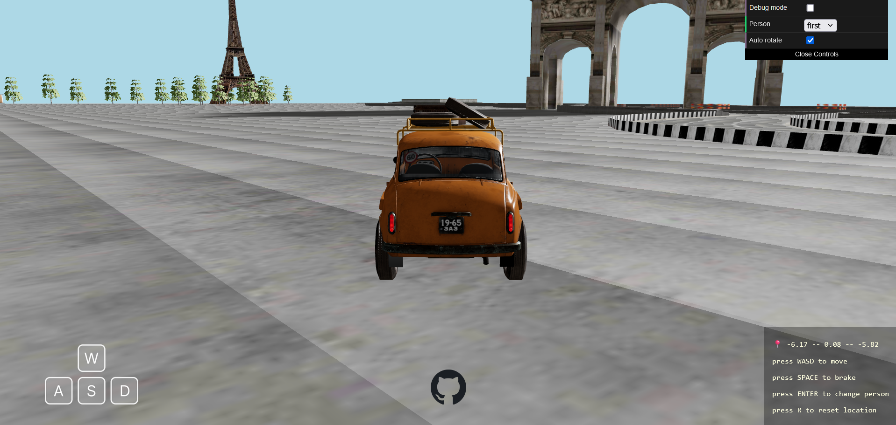

## Yêu cầu

- NodeJS để chạy chương trình,
- `git` để tải repository này về máy.

## Hướng dẫn sử dụng

### Cài đặt

```{bash}
git clone https://github.com/hnthap/car-ride.git --depth=1
cd car-ride
npm install
```

### Chạy

```{bash}
npm run build
npm run preview
```

### Dev mode

```{bash}
npm run dev
```

## Ghi công

### Hình ảnh

| Hình ảnh | Mô tả | Nguồn | Giấy phép |
| --- | --- | --- | --- |
|  | Các phím di chuyển | [*Ecctrl + Fisheye*](https://codesandbox.io/s/nvk9pf) | Không áp dụng |
| 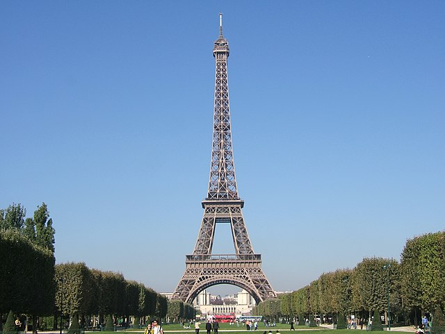 | Tháp Eiffel | [Tognopop (Wikimedia Commons)](https://commons.wikimedia.org/wiki/File:Eiffel_Tower_20051010.jpg) | [Phạm vi công cộng](https://en.wikipedia.org/wiki/Public_domain) |
| 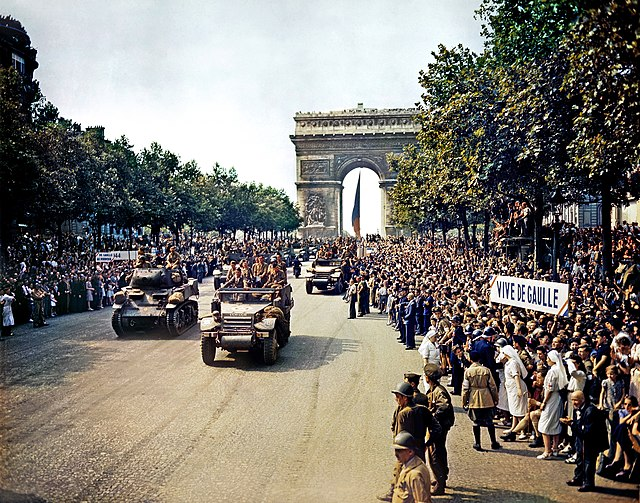 | Khải hoàn môn | [Jack Downey (Wikimedia Commons)](https://commons.wikimedia.org/wiki/File:Crowds_of_French_patriots_line_the_Champs_Elysees-edit2.jpg) | [Phạm vi công cộng](https://en.wikipedia.org/wiki/Public_domain) |
| 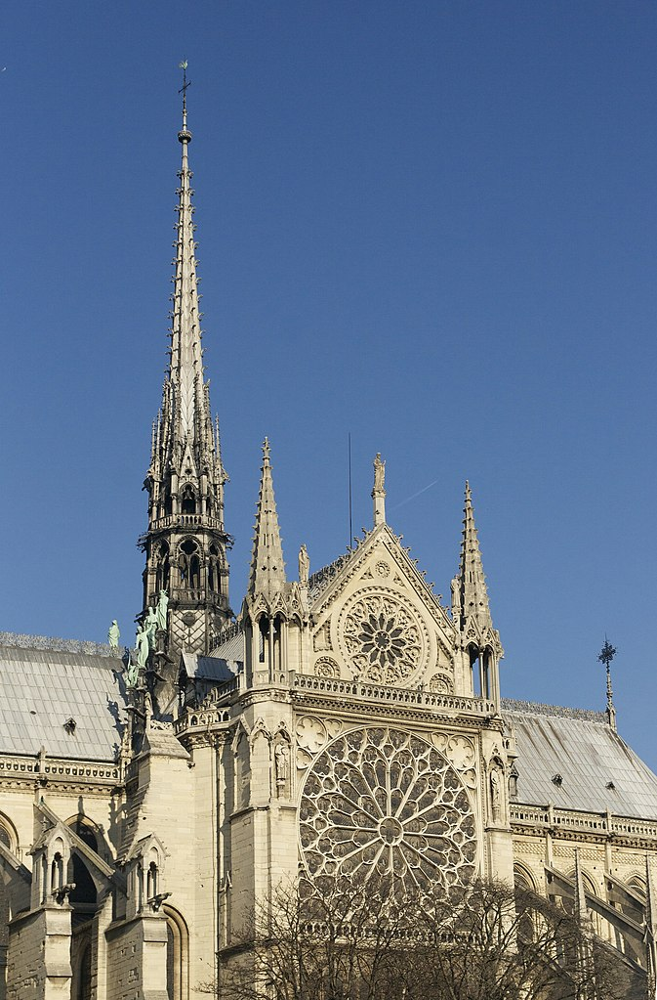 | Nhà thờ Đức Bà Paris | [Jebulon (Wikimedia Commons)](https://commons.wikimedia.org/wiki/File:Fl%C3%A8che_et_rosace_transept_sud_Notre-Dame_de_Paris.jpg) | [CC0 1.0](./LICENSES/cc0-1-0.txt) |

### Mô hình 3D

| Mô hình | Mô tả | Nguồn | Giấy phép |
| --- | --- | --- | --- |
| 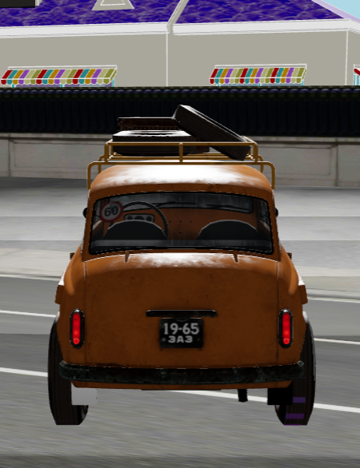 | Xe | [Car Scene](https://skfb.ly/6uSoM) của toivo | [CC-BY 4.0](./LICENSES/cc-by-4-0.txt) |
| 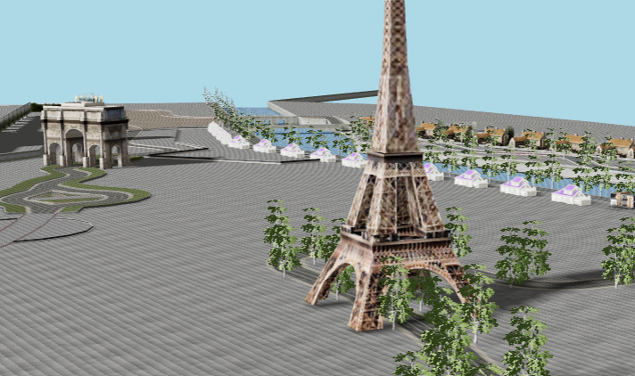 | Địa hình, đường xá, tháp Eiffel và Khải hoàn môn | [sport car racing paris](https://skfb.ly/oIME6) của amogusstrikesback2 | [CC-BY 4.0](./LICENSES/cc-by-4-0.txt) |
| 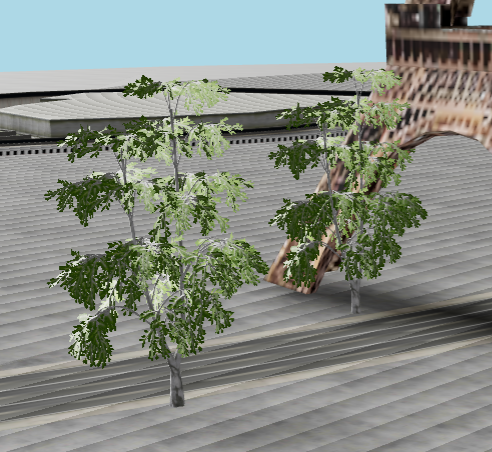 | Cây bạch dương | [Birch Tree](https://sketchfab.com/3d-models/birch-tree-aa842dffd9654d33b8b91170ce83c172) của evolveduk | [CC-BY 4.0](./LICENSES/cc-by-4-0.txt) |
| 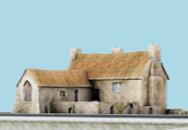 | Nhà thường | [Preceptory and Dower House - game asset](https://sketchfab.com/3d-models/preceptory-and-dower-house-game-asset-50d31c70e44b4000b17d81ff0fbcdf98) của Andy Woodhead | [CC-BY 4.0](./LICENSES/cc-by-4-0.txt) |
| 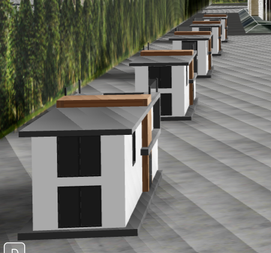 | Nhà thường | [Modern Home](https://sketchfab.com/3d-models/modern-home-7054d2d8710b4213ad3857c1e37e57ec) của Ciolan-T. Sebastian | [CC-BY 4.0](./LICENSES/cc-by-4-0.txt) |
| 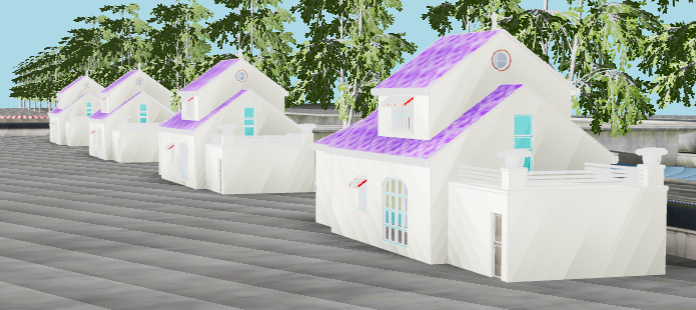 | Nhà thường | [Oggy House](https://sketchfab.com/3d-models/oggys-house-d65ef2f37773403b8f40cd9f49faec13) của 18sh Det Har Ar Hadeed NAUTTP | [CC-BY 4.0](./LICENSES/cc-by-4-0.txt) |
| 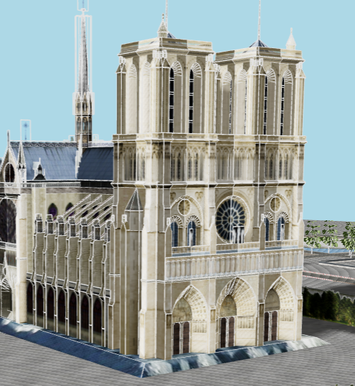 | Nhà thờ Đức Bà Paris | [Notre-Dame de Paris](https://sketchfab.com/3d-models/notre-dame-de-paris-cbe2bbde869c4139912ce2cc35567d2c) của copybrian | [CC-BY 4.0](./LICENSES/cc-by-4-0.txt) |
