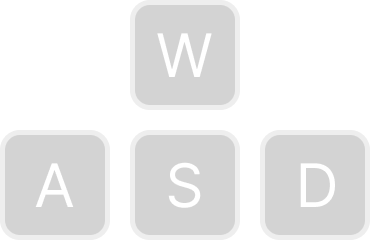

# Giả lập di chuyển xe

Đồ án môn Đồ họa máy tính CS105.O22.KHCL của nhóm 15.

## Yêu cầu

NodeJS.

## Hướng dẫn sử dụng

### Cài đặt

```{bash}
git clone https://github.com/hnthap/car-ride.git --depth=1
cd car-ride
npm install
```

### Chạy

```{bash}
npm run build
npm run preview
```

### Dev mode

```{bash}
npm run dev
```

## Ghi công

### Hình ảnh

| Hình ảnh | Mô tả | Nguồn | Giấy phép |
| --- | --- | --- | --- |
|  | Các phím di chuyển | [*Ecctrl + Fisheye*](https://codesandbox.io/s/nvk9pf) | Không áp dụng |
|  | Tháp Eiffel | [Tognopop (Wikimedia Commons)](https://commons.wikimedia.org/wiki/File:Eiffel_Tower_20051010.jpg) | [Phạm vi công cộng](https://en.wikipedia.org/wiki/Public_domain) |
|  | Khải hoàn môn | [Jack Downey (Wikimedia Commons)](https://commons.wikimedia.org/wiki/File:Crowds_of_French_patriots_line_the_Champs_Elysees-edit2.jpg) | [Phạm vi công cộng](https://en.wikipedia.org/wiki/Public_domain) |
|  | Nhà thờ Đức Bà Paris | [Jebulon (Wikimedia Commons)](https://commons.wikimedia.org/wiki/File:Fl%C3%A8che_et_rosace_transept_sud_Notre-Dame_de_Paris.jpg) | [CC0 1.0](https://creativecommons.org/publicdomain/zero/1.0/deed.en)


### Mô hình 3D

| Mô hình | Tên mô hình | Mô tả | Tác giả | Giấy phép |
| --- | --- | --- | --- | --- |
| https://skfb.ly/6uSoM | Car Scene | Xe | toivo | [CC-BY 4.0](https://creativecommons.org/licenses/by/4.0/) |
| https://skfb.ly/oIME6 | sport car racing paris | Địa hình, đường xá và Khải hoàn môn | amogusstrikesback2 | [CC-BY 4.0](https://creativecommons.org/licenses/by/4.0/) |

## Việc cần làm

### Dễ

- [x] Thêm nguồn ảnh
- [ ] Thêm nguồn mô hình vào các file JSX
- [ ] Bỏ các bức tường thấp và bãi cỏ xanh quanh Khải hoàn môn
- [ ] Thêm nhà và cây cho đỡ trống trải
- [ ] Dọn dẹp file không dùng đến
  
### Trung bình

- [ ] Sửa vị trí khởi đầu của xe
- [ ] Cải thiện GUI controller
- [ ] Control auto rotate.
- [ ] Nếu xe rơi tự do khỏi map, spawn xe về vị trí trước khi rơi
- [ ] Better control car movement.

### Khó

- [ ] Cho phép thay "áo" xe. (lam bô v.v.)
- [ ] Night mode.